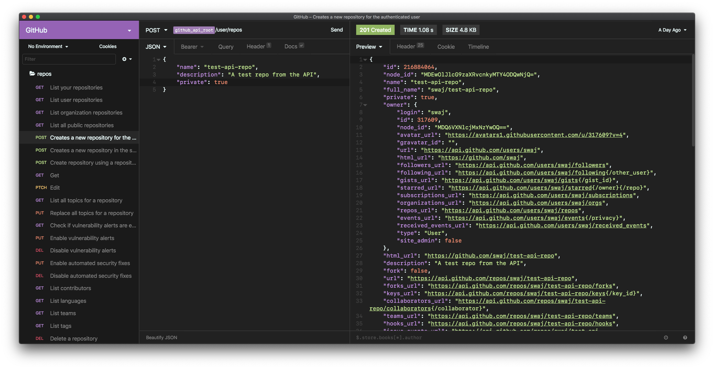

# Insomnia Material Darker (High Contrast) Theme

This is just a theme for the [Insomnia REST Client](https://insomnia.rest) that is designed to match the Material UI Darker (High Contrast) theme available for other editors.

## Installation

1.  Open Insomnia Preferences (Cmd + ,)
2.  Click the **Plugins** tab
3.  Use the npm package name: `insomnia-plugin-material-darker-hc-theme`
4.  Click **Install Plugin**
5.  Change your theme on the **Themes** tab

## Design Considerations

I've done my best to follow the Material Darker (HC) theme as closely as possible, with minimal deviations to just improve overall readability.

Please note that syntax highlighting in Insomnia is actually driven by overall background colors.  Given that there are so few options available, this is the best match I could get.

Enjoy :)
